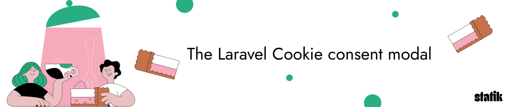
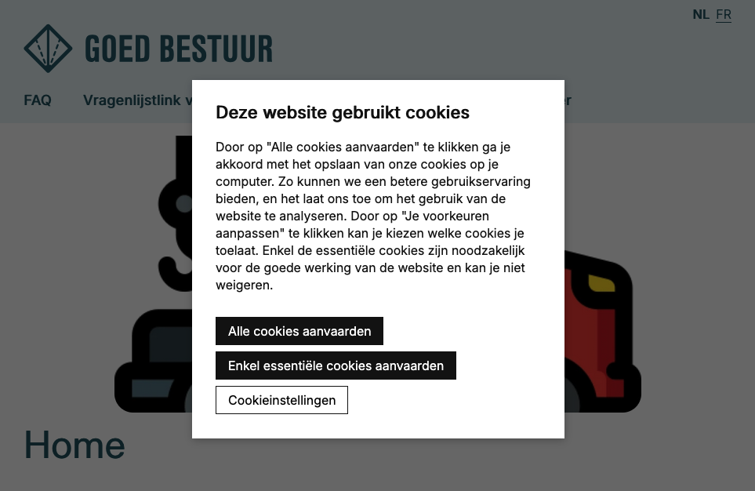
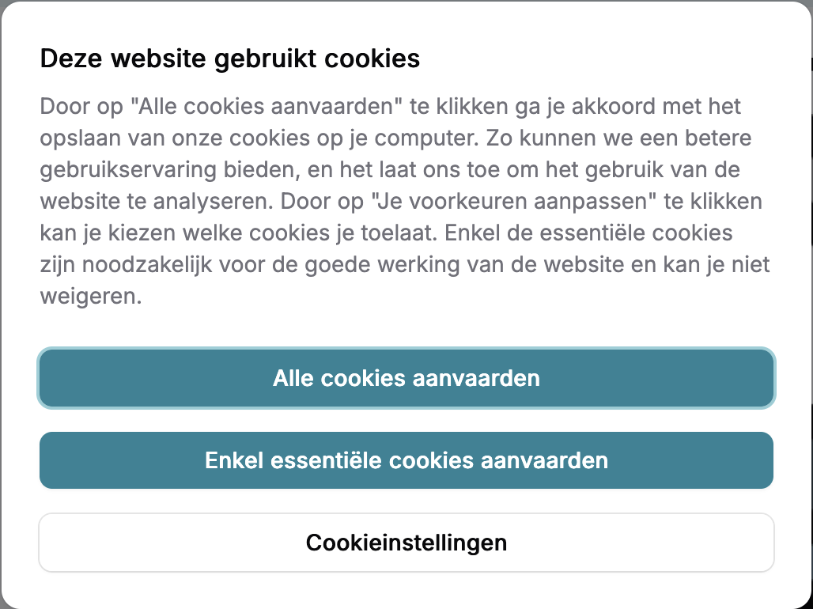

<p align="center"></p>

# Laravel cookie consent modal

[](https://packagist.org/packages/statikbe/laravel-cookie-consent)
[](https://packagist.org/packages/statikbe/laravel-cookie-consent)


The package includes a script & styling for a cookie banner and a modal where the visitor can select his/her cookie preferences.

This package is mainly based on the one from spatie: https://github.com/spatie/laravel-cookie-consent

With the only exception that you can choose which cookies you enable.
This only works when Google Tag Manager is correctly configured (some regex config based on the value set in the cookie).

- [Upgrading](upgrading.md)
- [Requirements](#requirements)
- [Installation](#installation)
- [Usage](#usage)
- [Customising the dialog texts](#customising-the-dialog-texts)
    - [Customising the dialog contents](#customising-the-dialog-contents)
    - [Customising the theme](#customising-the-theme)
    - [Publishing](#publishing)
        - [Config](#config)
        - [Don't show modal on cookie policy page or other pages](#dont-show-modal-on-cookie-policy-page-or-other-pages)
        - [Skip cookie consent on error pages](#skip-cookie-consent-on-error-pages)
        - [Translations](#translations)
        - [Views](#views)
- [Configure Google Tag Manager](#configure-google-tag-manager)
- [Security](#security)
- [License](#license)

## Upgrading

You can find our upgrading guides [here](upgrading.md).

## Requirements

- PHP 8.2 or higher
- Laravel 12 or 13

Support for Laravel 11 and earlier was dropped. If you are still on one of those versions,
install an earlier release of this package.

## Installation

You can install the package via composer:

```bash
composer require statikbe/laravel-cookie-consent
```

The package will automatically register itself.

First of all **you need to** publish the javascript and css files:

```bash
php artisan vendor:publish --provider="Statikbe\CookieConsent\CookieConsentServiceProvider" --tag="cookie-public"
```

When using the default theme, make sure to include the css/cookie-consent.css into your base.blade.php or any other base template you use.

```
<link rel="stylesheet" type="text/css" href="{{asset("vendor/cookie-consent/css/cookie-consent.css")}}">
```

If you want to use the filament theme, make sure to source the blade files in your tailwind config

tailwind v4: `@source` paths are resolved relative to the stylesheet they are declared in, so
walk back up to the project root from your css file:

```css
/* resources/css/app.css */
@source '../../vendor/statikbe/laravel-cookie-consent/resources/**/*.blade.php';

/* resources/css/filament/admin/theme.css */
@source '../../../../vendor/statikbe/laravel-cookie-consent/resources/**/*.blade.php';
```

tailwind v3 and below:
```js
// tailwind.config.js
export default {
    content: [
        './vendor/statikbe/laravel-cookie-consent/resources/**/*.blade.php',
    ],
}
```

The javascript file is included in the cookie snippet and will be added at the end of your body.

If you want to show the filament themed cookie banner outside of your filament panel, also make sure that you include the filament styles and scripts in your templates.

## Usage

Instead of including a snippet in your view, we will automatically add it. This is done using middleware, either applied to the whole `web` group or registered as an alias you apply to specific routes:

```php
// bootstrap/app.php

->withMiddleware(function (Middleware $middleware) {
    ...
    $middleware->web(append: [
        ...
        \Statikbe\CookieConsent\CookieConsentMiddleware::class,
    ]);

// OR AS AN ALIAS

    $middleware->alias([
        ...
        'cookie-consent' => \Statikbe\CookieConsent\CookieConsentMiddleware::class,
    ]);
})

```

When you register it as an alias, apply it to the routes that need the banner:

```php
// routes/web.php

Route::middleware('cookie-consent')->group(function () {
    // ...
});
```

This will add the rendered `cookie-consent::index` view to the content of your response right before the last closing body tag.

The middleware leaves the response untouched when it is not an `Illuminate\Http\Response` (JSON, redirects, streamed and downloaded responses) or when the body contains no `</body>` tag, so it is safe to apply broadly.

## Customising the dialog texts

If you want to modify the text shown in the dialog you can publish the lang-files with this command:

```bash
php artisan vendor:publish --provider="Statikbe\CookieConsent\CookieConsentServiceProvider" --tag="cookie-lang"
```

This will publish the translations to `lang/vendor/cookie-consent/{locale}/texts.php`, for example `lang/vendor/cookie-consent/en/texts.php`.

```php

return [
    'alert_title' => 'This website uses cookies',
    'setting_analytics' => 'Analytical cookies',
];
```

The package ships with `en`, `nl`, `fr`, `es` and `oc` translations. If you need another
locale, copy one of these files over to `lang/vendor/cookie-consent/{locale}/texts.php` and
fill in the translations.

The `settings_text` key receives a `:policyUrl` placeholder, filled from the
`policy_url_{locale}` config key, so add a config entry for every locale you use. When using
the filament theme, the settings text is read from `filament.settings_text` instead.

### Customising the dialog contents

If you need full control over the contents of the dialog. You can publish the views of the package:

```bash
php artisan vendor:publish --provider="Statikbe\CookieConsent\CookieConsentServiceProvider" --tag="cookie-views"
```

This will copy the `index` view file over to `resources/views/vendor/cookie-consent`.

Note that this tag always publishes the **default theme** views. If you use the filament
theme, copy the views from
`vendor/statikbe/laravel-cookie-consent/resources/views-filament` instead.

Keep the `js-lcc-*` classes and the `data-cookie-*` attributes on `.js-lcc-modal-alert` in
place when you edit the published views: the bundled javascript binds to them and reads its
configuration from them.

Nothing reopens the preferences modal after the visitor made a choice, so add a trigger
yourself. Most preferably in the footer next to the url of your cookie policy. Any element
with the `js-lcc-settings-toggle` class works:

```html
<a href="javascript:void(0)" class="js-lcc-settings-toggle">@lang('cookie-consent::texts.alert_settings')</a>
```

This gives your visitor the opportunity to change the settings again. When using the filament
theme, a settings link is added to the user menu automatically (see
`filament-nav-item-render-hook` in the config).

### Customising the theme

By default, the cookie popup will look like this:



If you are however working on a project that is using filament, you can opt to use filament components to render your cookie popup.

To do this, [publish the config](#config) and set the theme to `filament`

```php
'theme' => 'filament',
```

This will render the cookie popup like so:



The theme is a single global setting: the whole `cookie-consent::` view namespace is swapped at
boot, so every page gets the same banner. On a project that has both a public frontend and a
filament panel, pick the theme for the audience that needs the consent banner and add the
other one to [`ignored_paths`](#dont-show-modal-on-cookie-policy-page-or-other-pages).

### Publishing

#### Config

```bash
php artisan vendor:publish --provider="Statikbe\CookieConsent\CookieConsentServiceProvider" --tag="cookie-config"
```

This is the contents of the published config-file:
This will read the policy urls from your env.

```php
use Filament\View\PanelsRenderHook;

return [
    /**
     * Theme to use for the cookie consent popup.
     * Available options: 'default', 'filament'.
     */
    'theme' => 'default',
    'filament-nav-item-render-hook' => PanelsRenderHook::USER_MENU_PROFILE_AFTER,
    'cookie_key' => '__cookie_consent',
    'cookie_value_analytics' => '2',
    'cookie_value_marketing' => '3',
    'cookie_value_both' => 'true',
    'cookie_value_none' => 'false',
    'cookie_expiration_days' => '365',
    'gtm_event' => 'cookie_refresh',
    'ignored_paths' => [],
    /**
     * Skip cookie consent on error responses (4xx and 5xx status codes).
     * Set to true if you want to disable cookie banner on error pages.
     */
    'skip_on_error_responses' => false,
    'cookie_secure' => env('COOKIE_CONSENT_SECURE', false),
    'policy_url_en' => env('COOKIE_POLICY_URL_EN', null),
    'policy_url_fr' => env('COOKIE_POLICY_URL_FR', null),
    'policy_url_nl' => env('COOKIE_POLICY_URL_NL', null),
];
```

You can customize some settings that work with your GTM.

The `filament-nav-item-render-hook` key defines where the settings link is registered inside a
filament panel. Set it to `null` to disable that link. It is only used when
`'theme' => 'filament'`.

#### Don't show modal on cookie policy page or other pages

If you don't want the modal to be shown on certain pages you can add the relative url to the ignored paths setting. This also accepts wildcards (see the Laravel `Str::is()` [helper](https://laravel.com/docs/12.x/helpers#method-str-is)).

The paths are matched against `$request->getPathInfo()`, so include the leading slash and any
locale prefix.

```php
'ignored_paths' => ['/en/cookie-policy', '/api/documentation*'],
```

#### Skip cookie consent on error pages

By default, the cookie consent banner is shown on error pages (404, 500, etc.). If you want to disable the banner on error responses, you can set this option to `true`:

```
'skip_on_error_responses' => true,
```

#### Translations

```bash
php artisan vendor:publish --provider="Statikbe\CookieConsent\CookieConsentServiceProvider" --tag="cookie-lang"
```

#### Views

```bash
php artisan vendor:publish --provider="Statikbe\CookieConsent\CookieConsentServiceProvider" --tag="cookie-views"
```

## Configure Google Tag Manager

All the steps to configure your Google Tag Manager can be found [here](docs/google-tag-manager.md).

## Star History

<a href="https://www.star-history.com/?repos=Statikbe%2Flaravel-cookie-consent&type=date&legend=top-left">
 <picture>
   <source media="(prefers-color-scheme: dark)" srcset="https://api.star-history.com/chart?repos=Statikbe/laravel-cookie-consent&type=date&theme=dark&legend=top-left" />
   <source media="(prefers-color-scheme: light)" srcset="https://api.star-history.com/chart?repos=Statikbe/laravel-cookie-consent&type=date&legend=top-left" />
   
 </picture>
</a>

## Security

If you discover any security related issues, please email [info@statik.be](mailto:info@statik.be) instead of using the issue tracker.

## License

The MIT License (MIT). Please see [License File](license.md) for more information.
